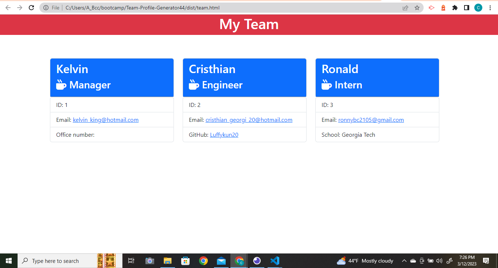

# Team Profile Generator

  
  
    
## [Table of Contents](#table-of-contents)

- [Description](#description)
- [Installation](#installation)
- [Usage](#usage)
- [Contributing](#contributing)
- [Test](#test)
- [License](#license)
- [Questions](#questions)

## [Description](#table-of-contents)

This Node.js Command-line application takes in information about employees that then will generate a Team-Profile HTML webpage that will display summaries for each employee. It works by taking the user's input, and creating an HTML file using markdown language.

## [Installation](#table-of-contents)
    
To install this application, clone the repository's code, open it in VS Code, open the terminal of your preference,  and run the following command: "node index.js"

## [Usage](#table-of-contents)
    
To use this application, open VS Code, open the terminal of your preference, enter the command "node index.js" and answer the prompted questions.

The following video link demostrates the steps four using this application: [Demostration]

The following image shows how the Team-Profile website will look like:

    

  ## [Contributing](#table-of-contents)

  Thanks! But I am not accepting foreign contributions at the moment.

## [Test](#table-of-contents)

There are 4 test suites with a total of 14 tests to ensure proper functioning of each extension of the Employee class (Manager, Engineer, and Intern)

## [License](#table-of-contents)

    Copyright (C) 2023 Cristhian Bustamante

   Permission is hereby granted, free of charge, to any person obtaining a copy of this software and associated documentation files (the "Software"), to deal in the Software without restriction, including without limitation the rights to use, copy, modify, merge, publish, distribute, sublicense, and/or sell copies of the Software, and to permit persons to whom the Software is furnished to do so, subject to the following conditions:

   The above copyright notice and this permission notice shall be included in all copies or substantial portions of the Software.

   THE SOFTWARE IS PROVIDED "AS IS", WITHOUT WARRANTY OF ANY KIND, EXPRESS OR IMPLIED, INCLUDING BUT NOT LIMITED TO THE WARRANTIES OF MERCHANTABILITY, FITNESS FOR A PARTICULAR PURPOSE AND NONINFRINGEMENT. IN NO EVENT SHALL THE AUTHORS OR COPYRIGHT HOLDERS BE LIABLE FOR ANY CLAIM, DAMAGES OR OTHER LIABILITY, WHETHER IN AN ACTION OF CONTRACT, TORT OR OTHERWISE, ARISING FROM, OUT OF OR IN CONNECTION WITH THE SOFTWARE OR THE USE OR OTHER DEALINGS IN THE SOFTWARE.       
   
   https://opensource.org/licenses/MIT
        
## [Questions](#table-of-contents)

- You can reach me through https://github.com/Luffykun20
- Also, you can contact me through my e-mail: [cristhian_georgia_20@hotmail.com](mailto:cristhian_georgia_20@hotmail.com) if you have any question.
